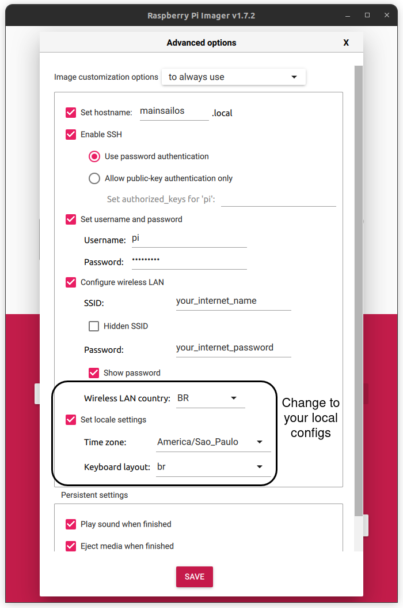
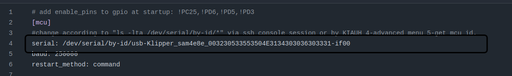
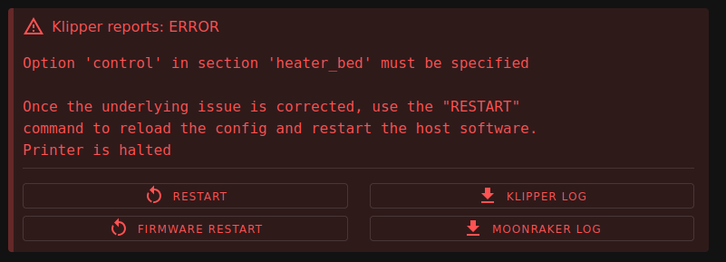
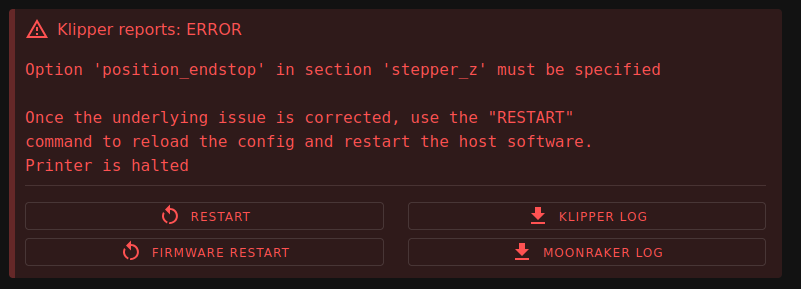

# Da-Vinci-1.0-Pro-Klipper

#### Eu usei:
- Raspberry PI 3 model B+ 2017 (Pode ser qualquer uma);

-  Cartão SD(16GB) para bootar o MainsailOS(Klipper) na Rasp;

-  Notebook(Ubuntu 22.04) para configurar a Rasp(ou um monitor HDMI);
  
-  Impressora 3D Da Vinci 1.0 Pro (outras versões podem variar);
  
-  Cabo USB para Arduino;

## 1. Instale o Raspberry Pi Imager e grave o MainsailOS 3.0.0 no seu cartão SD

Raspberry Pi Imager: https://www.raspberrypi.com/software/

Linux:

    sudo apt update
    sudo apt install rpi-imager
    rpi-imager

#### Após a instalação selecione: 

  CHOOSE OS --> Other specific-purpose OS --> 3D printing --> MainsailOS 3.0.0 - Raspberry Pi(32-bit)

#### Selecione o seu Cartão SD:

CHOOSE STORAGE

#### Antes de gravar, acesse as configurações:


##### OBS: 

Algumas Raspberry podem não acessar redes 5Ghz, prefira utilizar 2.4Ghz

Utilizei username e hostname padrão pois não estavam sendo salvos. (password: raspberry)

#### Com o seu cartão SD gravado, insira ele na Rasp e a ligue

## 2. Configurar a Rasp

Para esse passo, eu utilizei SSH para acessar a Rasp remotamente, mas você também pode usar um monitor e um teclado.

#### Primeiro se conecte na mesma rede que a sua Rasp(Precisa ser uma rede com internet para esse passo)

#### Acesse a sua Rasp:

Linux/Mac/Windows:

    ssh usuario@hostname.local

usuário padrão (usuário: pi  senha: raspberry)

ou

```bash
sudo apt install nmap -y
nmap -sn 192.168.1.0/24
```
```bash
ssh usuario@<IP-DA-RASP>
```

#### Atualizar o OS

    sudo apt update
    sudo apt upgrade 
    sudo reboot

#### Você também pode acessar:

Configurações

    sudo raspi-config

Gerenciar conexões Wi-Fi

    sudo nmtui

## 3. Criar o Firmware da placa da impressora(Klipper)

#### Crie o Firmware para a sua impressora
```bash
cd ~/klipper
make menuconfig
```
Configure o menu com os seguintes parâmetros para a DaVinci 1.0 Pro:

- Micro-controller Architecture: SAM3/SAM4 (Atmel SAM)

- Processor model: SAM4E8E

- Communication interface: USB

Pressione **Q**, depois **Y** para salvar. E compile o firmware:

```bash
make
```
*O arquivo gerado ficará salvo em ~/klipper/out/klipper.bin*

#### Baixe o Firmware para o seu PC

Copie para ~/printer_data/config/

    sudo cp ~/klipper/out/klipper.bin ~/printer_data/config/firmware.bin

Acesse:

    http://hostname.local/

Vá em Machine e baixe o arquivo firmware.bin para o seu PC

## 4. Colocar a Placa-Mãe em Modo Bootloader(ERASE)

*Faça por sua própria conta e risco*

1. Desligue a impressora e desconecte-a da tomada.
2. Procure por dois pinos, ou "blocos" de solda, indicados como SW2 (versões antigas: J37 ou JP1/ERASE)
3. Faça um curto nesses dois pinos utilizando um jumper
4. Ligue a impressora por 5 segundos e a desligue
5. Remova o curto entre os dois pinos
6. Conecte o cabo USB para Arduino na placa e no seu PC e ligue a impressora novamente

#### Verifique se funcionou

Cabo USB está conectado?

    ls /dev/ttyACM*

Teste com o *bossac*

    sudo bossac -p /dev/ttyACM0 -i

Deve aparecer informações sobre o MCU da sua placa

Caso a tela LCD exiba blocos estáticos, provavelmente funcionou também

## 5. Gravar o Klipper na placa da impressora

    sudo bossac -p /dev/ttyACM0 -e -w -v -b -R ~/YOUR-PATH-TO/firmware.bin

A saída não deve conter erros.

## 6. Criar o arquivo de configurações printer.cfg

#### Para esse passo conecte a sua impressora na sua Rasp

#### Obtenha o ID da MCU na Rasp

    ls /dev/serial/by-id/*

#### Acesse o MainsailOS no seu PC

http://hostname.local/

Vá em Machine, crie um arquivo novo e o chame de **printer.cfg**

Acesse o printer.cfg, copie e cole tudo que está no arquivo [DaVinci_1_0_Pro_printer.cfg](DaVinci_1_0_Pro_printer.cfg)

*Esse arquivo está configurado para impressoras Da Vinci 1.0 Pro*


No início do arquivo, altere o valor da serial destacado na imagem abaixo, para o seu ID de serial obtido a cima


Com isso, já deve ser possível conversar com o MCU.

## 6. Configurar o printer.cfg

Foi necessário mais dois passos para eu realmente conseguir mexer na impressora

#### Primeiro erro:


Vá até heater_bed e descomente as linhas necessárias

[heater_bed]
heater_pin: PD12
sensor_type: DaVinciBed
sensor_pin: PA20
min_temp: -20
max_temp: 130
control: pid
pid_kp: 76.125
pid_ki: 1.591
pid_kd: 910.651

#### Segundo erro:


Vá até stepper_z e descomente as linhas necessárias

[stepper_z]
step_pin: PC20
dir_pin: !PD7
enable_pin: PD6
microsteps: 32
full_steps_per_rotation: 200
rotation_distance: 1.25
endstop_pin: ^PD9
position_endstop: -6.102
position_min: -6.125
position_max: 201.25
homing_speed: 4
homing_retract_dist: 0
homing_retract_speed: 3
second_homing_speed: 2

## Créditos:

Jo Info Tech: [Como Instalar o Firmware Klipper na Impressora](https://www.youtube.com/watch?v=Tgbp7A-5afQ)

DaVinci-10: [DaVinci1.0_Klipper](https://github.com/DaVinci-10/DaVinci1.0_Klipper/)
